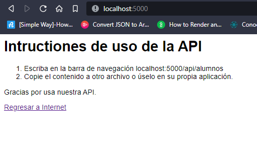

# Acerca de la aplicación

Importante: Antes de usar el servidor debe ingresar a la carpeta 'api' desde una terminal y escribir:

`npm install`

Instalará cada uno de los paquetes necesarios para que la aplicación funcione.

Debido a que estos módulos tienden a contener un volumen de información alto. Esto se traduce en más tiempo en su descarga.

---

La aplicación consta de los siguientes módulos:

## Servidor API

Es el primero módulo, se accede, por medio de una terminal, con el comando:

`npm run gen:app`

Este comando generará tres archivos binarios ejecutables, dependiendo de su sistema operativo. Mostrará, además, un listado del directorio actual. Si ejecuta por ejemplo el archivo generado en el paso anterior(app-win.exe), le enviará por terminal el mensaje:

`Listening on port 5000`

Indicándole que deberá acceder a la dirección localhost:5000 en su navegador preferido y seguir las instruciones de la API.

Como se ve, deberá escribir en el navegador

`localhost:5000/api/alumnos`

Para acceder a la data en formato JSON. Queda entonces o guardar el archivo o o usarlo en su aplicación Cliente.

## **Aplicación Web Cliente**

Tiene como objetivo:

- Consumir la data desde una API.
- Visualizar la data de la API.
- Realizar modificaciones en datos de la lista.

El acceso a la web es por medio del comando en una terminal:

`npm start`

Mostrando

`Listening on port 3000`

Indicándole que deberá acceder a la dirección localhost:3000 en su navegador preferido.

Esperamos que disfrute de esta aplicación.

> Acerca del autor:
>
> Me llamo David Erwin Montero Urrutia y me puedes contactar en mi [correo personal](mailto://david.montero.urrutia@gmail.com). Si te interesan más proyectos como estos visita mi perfil en [GitHub](<[https://github.com/APIMontero/APIMontero]()>). Ahora, si deseas mas ayuda puedes enviarme un [WhatsApp](https://wa.link/gk9lvu).

